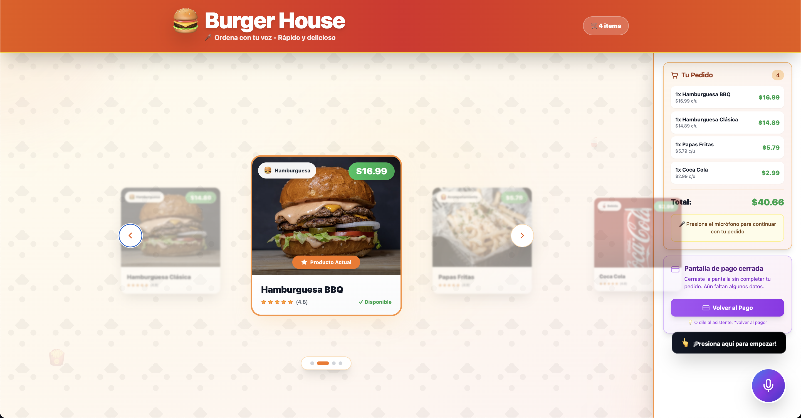

# 🍔 Burger House - Sistema de Pedidos por Voz

Sistema completo de pedidos de comida mediante voz que utiliza la API Realtime de OpenAI para crear una experiencia conversacional fluida y natural.




## 🎯 Características

- **Pedidos por Voz**: Los clientes hablan naturalmente con un asistente de IA
- **Carrusel Visual Sincronizado**: Los productos se muestran automáticamente cuando se mencionan
- **Gestión de Carrito en Tiempo Real**: Agrega, elimina y visualiza productos instantáneamente
- **Recolección Automática de Datos**: El asistente pide nombre, teléfono, email y dirección por voz
- **Checkout Inteligente**: Pantalla de pago que se abre automáticamente cuando el cliente está listo
- **Recuperación de Errores**: Manejo robusto de interrupciones y cierres accidentales
- **Diseño Responsivo**: Interfaz moderna y atractiva

## 🏗️ Arquitectura

```
┌─────────────────┐         ┌──────────────────┐         ┌─────────────────┐
│   Frontend      │         │    Backend       │         │   OpenAI API    │
│   (Next.js)     │◄───────►│   (FastAPI)      │◄───────►│   (Realtime)    │
│                 │  REST   │                  │  WebRTC │                 │
│  - UI/UX        │         │  - Functions     │         │  - Voice AI     │
│  - WebRTC       │         │  - Cart Logic    │         │  - TTS/STT      │
│  - State Mgmt   │         │  - Validation    │         │  - Function     │
└─────────────────┘         └──────────────────┘         └─────────────────┘
```

### Stack Tecnológico

#### Backend
- **FastAPI**: Framework web moderno y rápido para Python
- **OpenAI Realtime API**: API de voz en tiempo real con function calling
- **Pydantic**: Validación de datos y configuración
- **Uvicorn**: Servidor ASGI de alto rendimiento

#### Frontend
- **Next.js 14**: Framework de React con App Router
- **React**: Biblioteca de UI
- **Zustand**: Gestión de estado ligera
- **Tailwind CSS**: Framework de CSS utility-first
- **WebRTC**: Comunicación en tiempo real para audio

## 📋 Prerrequisitos

- **Python**: 3.11 o superior
- **Node.js**: 18.0 o superior
- **npm**: 9.0 o superior
- **Cuenta de OpenAI**: Con acceso a la API Realtime

## 🚀 Instalación Local

### 1. Clonar el Repositorio

```bash
git clone https://github.com/tu-usuario/burger-house-voice-ordering.git
cd burger-house-voice-ordering
```

### 2. Configurar el Backend

```bash
# Crear entorno virtual
python -m venv venv

# Activar entorno virtual
# En Windows:
venv\Scripts\activate
# En macOS/Linux:
source venv/bin/activate

# Instalar dependencias
pip install -r backend/requirements.txt

# Crear archivo .env en la raíz del proyecto
cp .env.example .env
```

Edita `.env` y agrega tu API key de OpenAI:

```env
OPENAI_API_KEY=sk-proj-tu-api-key-aqui
OPENAI_MODEL=gpt-4o-realtime-preview-2024-10-01
CORS_ORIGINS=["http://localhost:3000"]
```

### 3. Configurar el Frontend

```bash
cd frontend

# Instalar dependencias
npm install

# Crear archivo .env.local
cp env.local .env.local
```

Edita `.env.local`:

```env
NEXT_PUBLIC_API_URL=http://localhost:8000/api/v1
```

### 4. Ejecutar la Aplicación

#### Terminal 1 - Backend:

```bash
# Desde la raíz del proyecto
cd backend
uvicorn app.main:app --reload --host 0.0.0.0 --port 8000
```

El backend estará disponible en `http://localhost:8000`

#### Terminal 2 - Frontend:

```bash
# Desde la raíz del proyecto
cd frontend
npm run dev
```

El frontend estará disponible en `http://localhost:3000`

## 📖 Uso

1. **Abrir la aplicación** en `http://localhost:3000`
2. **Presionar el botón de micrófono** (botón azul/morado flotante)
3. **Hablar con el asistente**:
   - "Quiero una hamburguesa clásica"
   - "Agrégame unas papas"
   - "Procede al pago"
4. **Proporcionar datos de entrega** cuando el asistente los solicite
5. **Ingresar datos de tarjeta** en la pantalla de pago
6. **Confirmar el pedido**

### Comandos de Voz Comunes

| Comando | Acción |
|---------|--------|
| "Quiero una [producto]" | Agrega producto al carrito |
| "Dame 2 hamburguesas BBQ" | Agrega múltiples productos |
| "¿Qué tienen?" | Muestra el menú |
| "Ver mi carrito" | Muestra productos agregados |
| "Elimina las papas" | Remueve producto del carrito |
| "Estoy listo para pagar" | Abre pantalla de checkout |
| "Volver al pago" | Reabre checkout si se cerró |

## 🧪 Testing

### Backend

```bash
cd backend
pytest tests/ -v --cov=app
```

### Frontend

```bash
cd frontend
npm test
```

## 🏭 Despliegue

### Opción 1: Despliegue Manual

#### Backend (Railway/Render/Fly.io)

1. **Crear cuenta** en la plataforma elegida
2. **Conectar repositorio** de GitHub
3. **Configurar variables de entorno**:
   - `OPENAI_API_KEY`
   - `OPENAI_MODEL`
   - `CORS_ORIGINS` (incluir dominio del frontend)
4. **Configurar comando de inicio**:
   ```bash
   uvicorn backend.app.main:app --host 0.0.0.0 --port $PORT
   ```

#### Frontend (Vercel/Netlify)

1. **Importar proyecto** desde GitHub
2. **Configurar**:
   - Framework Preset: `Next.js`
   - Build Command: `npm run build`
   - Output Directory: `.next`
3. **Variables de entorno**:
   - `NEXT_PUBLIC_API_URL`: URL del backend desplegado

### Opción 2: Docker (Recomendado)

```bash
# Construir y ejecutar con Docker Compose
docker-compose up -d

# Ver logs
docker-compose logs -f

# Detener
docker-compose down
```

### Opción 3: GitHub Actions (CI/CD)

El proyecto incluye workflows de GitHub Actions para:
- ✅ Tests automáticos en cada push
- ✅ Despliegue automático a producción
- ✅ Verificación de código (linting)

## 📁 Estructura del Proyecto

```
burger-house-voice-ordering/
├── backend/
│   ├── app/
│   │   ├── __init__.py
│   │   ├── main.py              # API FastAPI principal
│   │   ├── config.py            # Configuración
│   │   └── openai_service.py    # Lógica de OpenAI
│   ├── requirements.txt
│   └── requirements-dev.txt
├── frontend/
│   ├── src/
│   │   ├── app/
│   │   │   ├── page.tsx         # Página principal
│   │   │   ├── layout.tsx       # Layout
│   │   │   └── globals.css      # Estilos globales
│   │   ├── components/
│   │   │   ├── ProductCarousel.tsx
│   │   │   └── CheckoutView.tsx
│   │   ├── hooks/
│   │   │   └── useVoice.ts      # Hook de WebRTC
│   │   └── store/
│   │       └── cart.ts          # Estado global (Zustand)
│   ├── package.json
│   └── next.config.js
├── .env.example
├── .gitignore
├── docker-compose.yml
├── Dockerfile.backend
├── Dockerfile.frontend
└── README.md
```

## 🔧 Configuración Avanzada

### Variables de Entorno (Backend)

| Variable | Descripción | Por Defecto |
|----------|-------------|-------------|
| `OPENAI_API_KEY` | API Key de OpenAI | (requerido) |
| `OPENAI_MODEL` | Modelo de OpenAI | `gpt-4o-realtime-preview-2024-10-01` |
| `CORS_ORIGINS` | Orígenes CORS permitidos | `["http://localhost:3000"]` |

### Variables de Entorno (Frontend)

| Variable | Descripción | Por Defecto |
|----------|-------------|-------------|
| `NEXT_PUBLIC_API_URL` | URL del backend | `http://localhost:8000/api/v1` |

## 🐛 Troubleshooting

### Error: "No se puede conectar al backend"
- Verifica que el backend esté corriendo en el puerto 8000
- Revisa que `NEXT_PUBLIC_API_URL` esté correctamente configurado
- Verifica CORS en `backend/app/config.py`

### Error: "OpenAI API key inválida"
- Verifica que la API key en `.env` sea correcta
- Asegúrate de tener acceso a la API Realtime de OpenAI

### El micrófono no funciona
- Verifica que el navegador tenga permisos de micrófono
- Usa HTTPS en producción (requerido para WebRTC)
- Verifica que tu navegador soporte WebRTC

### El carrito no se actualiza
- Revisa la consola del navegador (F12)
- Verifica que el `session_id` se esté generando correctamente
- Revisa los logs del backend


